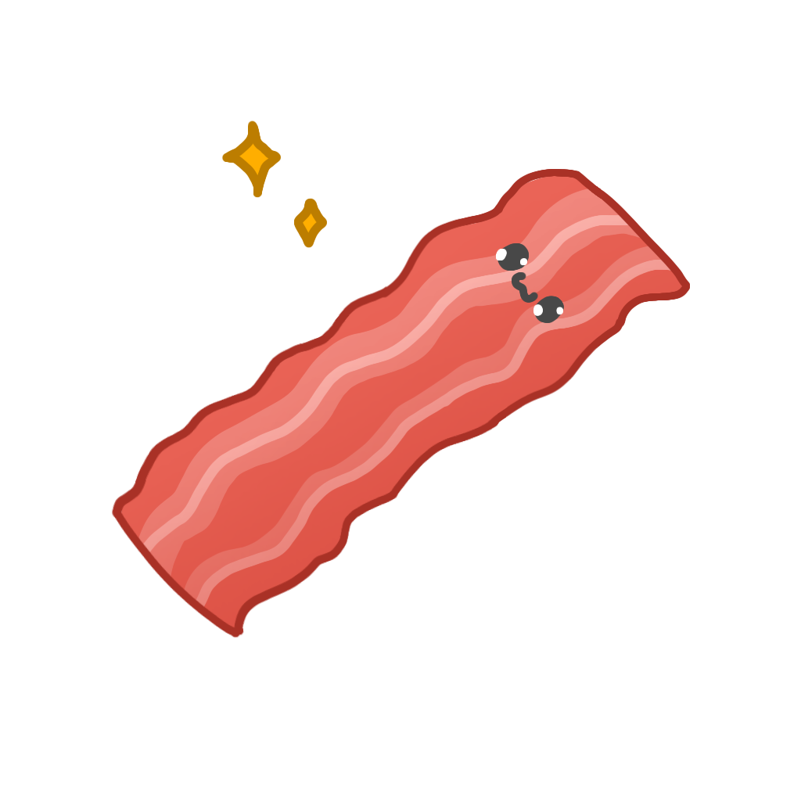

# About
## BCON - BCON Configures Only Nicely
`BCON` is a programming language designed specifically to create and store advanced project configurations in a way that is easy for humans to understand, while retaining advanced functionality of programming languages.

## Assumptions:
- Easy to read & write;
- Single-line and Multi-line Comments support;
- Multi-line strings with interpolation;
- Support for `RegExp`, `Date` and `File` variables;
- Support for numbers in every notation supported by `ES2023`;
- Data structuring via `arrays` and `dictionaries`;
- No arithmetic operations, language focused on **declaratively defining values**.

## Highlighting
There's also BCON highlighter for `VSCode` created by **yobonez**. <br/>
The only thing you need to do is download it from VSC marketplace:
- Name of addon: `BCON Syntax Hightlighting`
- [GitHub](https://github.com/yobonez/vscode-bcon-highlighting)



---

# Syntax
## Comments
- Multi-line comment:
```bcon
'This is a multi-
-line comment.'
```
- Single-line comment:
```bcon
# I work to the end of current line only.
```

## Data Types:
- Files: `"./path/to/file.extension".encoding`, e.g. `"./keywords.txt".utf8`;
- Strings: `"Here comes your string, [`**Main.users[0].username**`]!"`, `"I may be multi-`<br/>`-line for you!"`;
- Dates: `"MM-DD-YYYY, HH:MM:SS.MS".date`, e.g. `"01-01-1970, 12:43:13.773".date`;
- RegExps: `/your (expression)+/flags` e.g. `/[abc]+/gi`;
- Numbers: `0xNN...N`, `0bNN...N`, `Ne+NN`, `Ne-NN`, `.N`, `N.N`, `M`, also negative variants, `-N`, etc.;
- Keywords: `Undefined`, `Null`, `NaN`, `False`, `True`, `Infinity`;

## Data Structures:
- Dictionaries:
```bcon
[
	@key => value;
];
```
- Arrays:
```bcon
[
	@* => value;
];
```

## Expressions
- Imports:
```bcon
# Imports data from ./path/to/file.bcon and stores it as IDENTIFICATOR variable.

import "./path/to/file.bcon".utf8 as IDENTIFICATOR;
```
- Variables:
```bcon
# Stores value 0xFF00CC as color variable.

use 0xFF00CC as color;

# You may also need to store dictionaries or arrays:

use [
	@key => "Hello";
] as dictionary;

use [
	@* => "World!";
] as array;
```

## Destructurization
Sometimes you may need access to specific variable of imported file, of stored dictionary without referring to the entire object. If so - this is exactly what you need:
- Destructurization of dictionary:
```bcon
use [
	@username => "LenaKrukov1997";
	@age => 22;
] as user;

# In this example we are taking "age" key out of "user" dictionary and assigning its value to "age" variable.

use user as [
	age;
];

# But we can also control what variable's name should be. In this example we are taking "age" key out of "user" dictionary, and then assigning its value to "ALIAS" variable.

use user as [
	age => ALIAS;
];
```
- Destructurization of array:
```bcon
use [
	@* => "Hello";
	@* => "World!";
] as hello_world;

# In this example we are taking first key of "hello_world" array and assigning it to "hello" variable:

use hello_world as [
	hello;
];

# You may also wish to get another key, then let's get the second key of "hello_world" array, and assign it to "world" variable:

use hello_world as [
	;
	world;
];
```
- Destructurization of imported file:
```bcon
# Content of "./db-config.bcon" file:

[
	@hash => "SHA-256";
	@ip_address => 127.0.0.1;
	@users => [
		@* => [
			@username => "root";
			@password => "PsswdHR1234!";
		];
	];
];

# Content of "./config.bcon" file:

import "./db-config.bcon".utf8 as [
	users => [
		[
			username => ADMIN_USERNAME;
			password => ADMIN_PASSWORD;
		];
	];
];

# This one is used to take out the first user from "./db-config.bcon" and then assign it's username, and password properties to (in order) "ADMIN_USERNAME" and "ADMIN_PASSWORD" variables. 
```

## References
Sometimes you may need to access some variables, in your configuration object. It's simple:
- BCON is **case sensitive**, so `IDENTIFICATOR` doesn't refer to the same value as `Identificator` does;
- Refering to specific key of dictionary, or array may look like this: `dictionary.key1`, `dictionary[0].key1`, etc;
- You may refer to **Main** object using variable `Main` which includes already parsed part of your configuration;
- You may refer to **currently parsed** object using variable `This` which includes currently parsed part of your configuration;
- You may refer to number, or string from insides of a string variable using interpolation, e.g. `Hello, [Main.user.username]!`;

---

# BCON Parser
## Setup

After you require `bcon-parser`, you may wish to setup it:

```js
const
	BCON = require('bcon-parser');

console.log(Object.keys(BCON)) // ["parse", "stringify", "init"]
```

You can do it using **init** method that is included in module:

```js
BCON.init({
	allowRequire: false, // Set to true if you wish to `require()` bcon files.
	allowGlobal: false, // Set to true if you wish to refer to BCON globally [global.BCON].
	config: {
		defaultPath: __dirname, // Set to any path you wish, imports, and require will pick files relatively to given path.
		defaultEncoding: 'utf-8' // Set to any encoding supported by Node.JS, require will use it to decode files.
	}
});
```

## How to use it?

Using BCON parser is as simple as using node.js built-in JSON parser:
```js
BCON.parse(
`
use "v3.0.0" as version;

use [
	@privateKey => "./private.key"bin;
	@publicKey => "./public.key"bin;
] as keys;

import "./database.bcon".utf8 as [
	host => dbHost;
	port => dbPort;
];


[
  @version => version;
  @admin => [
    @username => "root";
    @password => "Q@wertyuiop";
  ];
  @keys => keys;
  @greeting => "Hello, [Main.admin.username]! The server is running on [dbHost]:[dbPort], its version is [version]."
  @database => [
    @host => dbHost;
    @port => dbPort;
    @username => Main.admin.username;
    @password => Main.admin.password;
  ];
  @localhostDirectory => "./views";
  @maxPasswordLength => 128;
  @passwordRegex => /[^a-zA-Z0-9\!@#$%\^&\*\(\)\{\}\[\];"'\/\\\.,]/g;
];
`
)
/* Expecting:
	{
		version: "v2.0.0",
		admin: {
			username: "root",
			password: "Q@wertyuiop"
		},
		keys: {
			public: <Buffer A7 B2 C7 ...>,
			private: <Buffer C3 A1 B8 ...>
		},
		greeting: "Hello, root! The server is running on 127.0.0.1:80, its version is v2.0.0.",
		database: {
			host: "127.0.0.1",
			port: 80,
			username: "root",
			password: "Q@wertyuiop"
		},
		localhostDirectory: "./views",
		maxPasswordLength: 128,
		passwordRegex: /[^a-zA-Z0-9\!@#$%\^&\*\(\)\{\}\[\];"'\/\\\.,]/g
	}
*/

BCON.stringify(
	[
		{
			username: "JohnDoe",
			age: 24,
			email: "john.doe@example.com",
			password: "password",
			favRegexp: /[abc]+/
		},
		{
			username: "FooBar",
			age: 20,
			email: "foo.bar@example.com",
			password: "password",
			favRegexp: /[def]+/
		},
		{
			username: "CatSamson",
			age: 21,
			email: "cat.samson@example.com",
			password: "password",
			favRegexp: /[ghi]+/
		}
	],
	null,
	'\t'
)
/*Expecting:
	[
		@* => [
			@username => "JohnDoe";
			@age => 24;
			@email => "john.doe@example.com";
			@password => "password";
			@favRegexp => /[abc]+/;
		];
		@* => [
			@username => "FooBar";
			@age => 20;
			@email => "foo.bar@example.com";
			@password => "password";
			@favRegexp => /[def]+/;
		];
		@* => [
			@username => "CatSamson";
			@age => 21;
			@email => "cat.samson@example.com";
			@password => "password";
			@favRegexp => /[ghi]+/;
		];
	];
*/
```